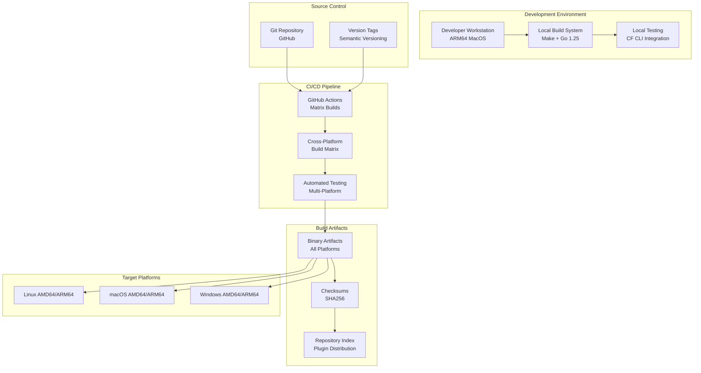
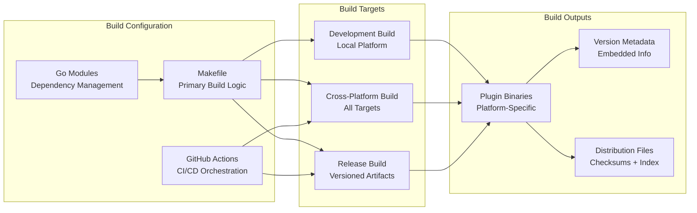

# Design Document: CF-CLI Plugin Modernization

## Overview

This design outlines the modernization of the CF-CLI plugin project to support comprehensive cross-platform builds using Go 1.25 on ARM64 MacOS. The modernization focuses on upgrading the Go runtime, analyzing and updating dependencies, enhancing the build system, and implementing modern CI/CD practices while maintaining backward compatibility and plugin functionality.

The current project already has a solid foundation with cross-platform build support and pure Go implementation (CGO_ENABLED=0). The modernization will build upon these strengths while addressing technical debt and leveraging modern tooling.

## Architecture

### High-Level Architecture



### Build System Architecture

The modernized build system will consolidate around a single, authoritative build configuration that supports both local development and CI/CD environments:



## Components and Interfaces

### 1. Go Runtime Upgrade Component

**Purpose**: Upgrade the project from Go 1.24 to Go 1.25 while maintaining compatibility and addressing breaking changes.

**Key Interfaces**:
- `go.mod` file specification
- Build system Go version detection
- Dependency compatibility validation
- Deprecated package replacement (io/ioutil → io + os)

**Implementation Details**:
- Update `go.mod` to specify `go 1.25`
- Replace deprecated `io/ioutil` package with `io` and `os` packages
- Update CI/CD to use Go 1.25 toolchain
- Validate all dependencies for Go 1.25 compatibility
- Test plugin functionality with new runtime

**Breaking Changes Addressed**:
- `io/ioutil.ReadFile` → `os.ReadFile`
- `io/ioutil.WriteFile` → `os.WriteFile`
- `io/ioutil.ReadDir` → `os.ReadDir`

### 2. Dependency Management Component

**Purpose**: Analyze, upgrade, and manage all project dependencies for Go 1.25 compatibility.

**Key Interfaces**:
- Go modules dependency resolution
- Compatibility validation APIs
- Security vulnerability scanning

**Implementation Details**:
- Automated dependency analysis using `go mod tidy` and `go list -m -u all`
- Dependency upgrade strategy prioritizing stability
- Integration with security scanning tools
- Documentation of breaking changes and migration paths

### 3. Cross-Platform Build System

**Purpose**: Provide comprehensive cross-platform build support with consistent results across environments.

**Key Interfaces**:
- Build target specification (GOOS/GOARCH combinations)
- Version metadata injection
- Artifact generation and naming

**Target Platforms**:
- `linux/amd64` - Primary Linux server platform
- `linux/arm64` - ARM-based Linux servers and containers
- `darwin/amd64` - Intel-based macOS development machines
- `darwin/arm64` - Apple Silicon macOS development machines
- `windows/amd64` - Windows development and server environments
- `windows/arm64` - Windows 11 ARM64 devices and Surface Pro X

**Build Configuration**:
```makefile
TARGETS := linux/amd64 linux/arm64 darwin/amd64 darwin/arm64 windows/amd64 windows/arm64
CGO_ENABLED := 0  # Pure Go builds for maximum compatibility
```

### 4. Version Management Component

**Purpose**: Provide comprehensive version metadata embedding and semantic versioning support.

**Key Interfaces**:
- Git tag-based version extraction
- Build metadata injection via ldflags
- Semantic version validation

**Metadata Fields**:
- Semantic version (major.minor.patch)
- Prerelease identifier (dev, rc, etc.)
- Build metadata (platform, date, VCS info)
- VCS information (commit hash, URL, date)

### 5. CI/CD Pipeline Component

**Purpose**: Modernize continuous integration from Travis CI to GitHub Actions with matrix builds.

**Key Interfaces**:
- GitHub Actions workflow specification
- Matrix build configuration
- Artifact publishing and release management

**Pipeline Stages**:
1. **Validation Stage**: Lint, format check, security scan
2. **Build Stage**: Cross-platform compilation using matrix strategy
3. **Test Stage**: Unit tests and integration tests across platforms
4. **Release Stage**: Artifact packaging, checksums, and distribution

**Matrix Configuration**:
```yaml
strategy:
  matrix:
    include:
      - goos: linux
        goarch: amd64
      - goos: linux
        goarch: arm64
      - goos: darwin
        goarch: amd64
      - goos: darwin
        goarch: arm64
      - goos: windows
        goarch: amd64
      - goos: windows
        goarch: arm64
```

### 6. Artifact Management Component

**Purpose**: Generate, validate, and distribute build artifacts with comprehensive metadata.

**Key Interfaces**:
- Binary artifact generation
- Checksum calculation and validation
- Repository index generation for plugin distribution

**Artifact Structure**:
```
releases/
├── cf-targets-plugin-v1.2.3+linux.amd64
├── cf-targets-plugin-v1.2.3+linux.amd64.sha256
├── cf-targets-plugin-v1.2.3+darwin.arm64
├── cf-targets-plugin-v1.2.3+darwin.arm64.sha256
├── cf-targets-plugin-v1.2.3+windows.amd64.exe
├── cf-targets-plugin-v1.2.3+windows.amd64.exe.sha256
└── repo-index.yml
```

### 7. Code Quality and Logging Component

**Purpose**: Ensure production-ready code quality with standardized logging and clean output.

**Key Interfaces**:
- Structured logging with UTC timestamps
- ASCII-only console output
- Debug code removal automation
- Error reporting standardization

**Implementation Details**:
- Remove all debug statements and temporary debugging code
- Implement UTC timestamp logging for all output
- Replace verbose debug messages with concise, informative output
- Standardize error reporting format across platforms
- Ensure ASCII-only characters in all log messages

**Logging Format**:
```
[2024-01-31T15:30:45Z] INFO: Target saved as production
[2024-01-31T15:30:46Z] ERROR: Target 'staging' does not exist
[2024-01-31T15:30:47Z] WARN: Current target has unsaved changes
```

## Data Models

### Build Configuration Model

```go
type BuildConfig struct {
    Version     SemanticVersion
    Targets     []PlatformTarget
    Metadata    BuildMetadata
    Artifacts   ArtifactConfig
}

type SemanticVersion struct {
    Major      int
    Minor      int
    Patch      int
    Prerelease string
    Build      string
}

type PlatformTarget struct {
    GOOS   string
    GOARCH string
    CGO    bool
}

type BuildMetadata struct {
    BuildDate    time.Time
    VCSUrl       string
    VCSCommit    string
    VCSDate      time.Time
    GoVersion    string
}

type ArtifactConfig struct {
    OutputDir    string
    NameTemplate string
    Checksums    []string // ["sha256", "sha1"]
}
```

### Dependency Analysis Model

```go
type DependencyAnalysis struct {
    Direct     []Dependency
    Indirect   []Dependency
    Conflicts  []DependencyConflict
    Upgrades   []DependencyUpgrade
}

type Dependency struct {
    Module     string
    Version    string
    GoVersion  string
    Compatible bool
    Issues     []string
}

type DependencyConflict struct {
    Module    string
    Required  []string
    Resolved  string
    Strategy  string
}

type DependencyUpgrade struct {
    Module      string
    FromVersion string
    ToVersion   string
    Breaking    bool
    Reason      string
}
```

## Correctness Properties

*A property is a characteristic or behavior that should hold true across all valid executions of a system-essentially, a formal statement about what the system should do. Properties serve as the bridge between human-readable specifications and machine-verifiable correctness guarantees.*

Let me analyze the acceptance criteria to determine which ones are testable as properties:

### Converting EARS to Properties

Based on the prework analysis, I'll convert the testable acceptance criteria into universally quantified properties, consolidating redundant properties for efficiency:

**Property 1: Cross-Platform Build Completeness**
*For any* supported target platform (linux/amd64, linux/arm64, darwin/amd64, darwin/arm64, windows/amd64, windows/arm64), the build system should successfully produce a functional plugin binary with correct platform-specific metadata embedded
**Validates: Requirements 3.1, 3.2, 3.4, 6.3, 8.1**

**Property 2: Go Version Compliance**
*For any* build environment, the build system should use Go 1.25 or later and validate that all dependencies are compatible with the specified Go version
**Validates: Requirements 1.2, 1.3, 2.1**

**Property 3: Plugin Functionality Preservation**
*For any* plugin command and target platform, the modernized plugin should maintain backward compatibility and continue to integrate properly with CF CLI without functional regression
**Validates: Requirements 1.4, 1.5, 8.3, 8.4, 8.5**

**Property 4: Build Artifact Consistency**
*For any* build artifact generated, the build system should produce consistent naming conventions, comprehensive metadata, and corresponding SHA256 checksums
**Validates: Requirements 3.5, 4.5, 7.1, 7.2, 7.4**

**Property 5: Dependency Management Correctness**
*For any* dependency upgrade or conflict resolution, the dependency manager should maintain API compatibility and resolve conflicts using the latest stable versions while documenting all changes
**Validates: Requirements 2.2, 2.3, 2.4, 2.5**

**Property 6: Build Process Consistency**
*For any* build environment (local or CI), the build system should use identical build processes and automatically extract version information from Git tags
**Validates: Requirements 4.2, 4.4, 5.2**

**Property 7: CI Pipeline Automation**
*For any* code push or release trigger, the CI pipeline should automatically build for all target platforms, run tests on multiple Go versions, and generate appropriate build artifacts
**Validates: Requirements 5.2, 5.3, 5.4, 5.5**

**Property 8: Performance Maintenance**
*For any* performance metric (startup time, command response time, memory usage, binary size), the modernized plugin should maintain or improve performance compared to the current version across all target platforms
**Validates: Requirements 10.1, 10.2, 10.3, 10.4, 10.5**

**Property 9: ARM64 MacOS Development Support**
*For any* development workflow on ARM64 MacOS, the build system should provide fast native builds and support cross-compilation to all target platforms
**Validates: Requirements 6.2, 6.5**

**Property 10: Error Reporting and Diagnostics**
*For any* compatibility issue or build error, the build system should report specific error details and provide comprehensive diagnostic information
**Validates: Requirements 8.2, 9.4**

**Property 11: Code Quality and Logging Standards**
*For any* log message or console output, the plugin should use only ASCII characters, include UTC timestamps, and provide concise information without debug statements in production builds
**Validates: Requirements 11.1, 11.2, 11.3, 11.4, 11.5, 11.6**

## Error Handling

### Build System Error Handling

The modernized build system will implement comprehensive error handling across all components:

**Dependency Resolution Errors**:
- Incompatible Go version detection with clear upgrade paths
- Dependency conflict resolution with detailed conflict reports
- Security vulnerability detection with remediation suggestions
- Network connectivity issues during dependency fetching

**Cross-Platform Build Errors**:
- Platform-specific compilation failures with diagnostic information
- Missing build tools or SDK detection
- CGO configuration validation and error reporting
- Binary validation failures with specific error details

**CI/CD Pipeline Error Handling**:
- Build matrix failure isolation to prevent cascade failures
- Artifact generation failures with retry mechanisms
- Test execution failures with detailed reporting
- Release publication failures with rollback capabilities

**Version Management Errors**:
- Git tag parsing failures with format validation
- Version metadata injection failures
- Semantic version validation with clear error messages
- Build metadata extraction failures

### Error Recovery Strategies

**Graceful Degradation**:
- Continue building for successful platforms when individual platform builds fail
- Generate partial artifacts when complete artifact generation fails
- Provide fallback version information when Git metadata is unavailable

**Retry Mechanisms**:
- Network-related dependency fetching with exponential backoff
- Transient CI/CD failures with configurable retry counts
- Artifact upload failures with multiple retry attempts

**Validation and Prevention**:
- Pre-build validation of build environment and dependencies
- Early detection of configuration issues before expensive build operations
- Comprehensive input validation for all build parameters

## Testing Strategy

### Dual Testing Approach

The testing strategy employs both unit testing and property-based testing to ensure comprehensive coverage:

**Unit Testing Focus**:
- Specific build configuration scenarios and edge cases
- Individual component functionality (version parsing, metadata extraction)
- Error condition handling and recovery mechanisms
- Integration points between build system components
- Platform-specific build variations and configurations

**Property-Based Testing Focus**:
- Universal properties that hold across all target platforms
- Build system behavior across different input combinations
- Cross-platform compatibility validation through randomized testing
- Performance characteristics across various build scenarios
- Dependency resolution behavior with different dependency graphs

### Testing Framework Configuration

**Property-Based Testing Setup**:
- **Framework**: Use `testing/quick` for Go property-based testing, supplemented with `github.com/leanovate/gopter` for advanced property testing
- **Test Configuration**: Minimum 100 iterations per property test to ensure comprehensive input coverage
- **Test Tagging**: Each property test must reference its corresponding design document property using the format:
  ```go
  // Feature: cf-cli-plugin-modernization, Property 1: Cross-Platform Build Completeness
  func TestCrossPlatformBuildCompleteness(t *testing.T) { ... }
  ```

**Unit Testing Configuration**:
- **Framework**: Standard Go testing framework with `testify` for assertions
- **Coverage**: Target 90%+ code coverage for critical build system components
- **Integration**: CF CLI integration tests using test fixtures and mock environments
- **Performance**: Benchmark tests for build performance regression detection

### Test Categories

**Build System Tests**:
- Cross-platform compilation validation
- Version metadata injection verification
- Artifact generation and naming consistency
- Checksum calculation and validation

**Dependency Management Tests**:
- Go 1.25 compatibility validation
- Dependency upgrade and conflict resolution
- Security vulnerability detection
- API compatibility preservation

**CI/CD Pipeline Tests**:
- GitHub Actions workflow validation
- Matrix build configuration testing
- Artifact publishing and release automation
- Multi-platform test execution

**Performance and Compatibility Tests**:
- Plugin startup and command execution performance
- Memory usage and binary size optimization
- CF CLI integration compatibility
- Cross-platform stability validation

### Test Execution Strategy

**Local Development Testing**:
- Fast unit tests for immediate feedback during development
- Selected property tests for critical functionality validation
- Integration tests with local CF CLI installation
- Performance benchmarks for regression detection

**CI/CD Testing**:
- Complete property test suite execution (minimum 100 iterations each)
- Cross-platform integration testing using GitHub Actions matrix
- Performance regression testing with baseline comparisons
- Security scanning and vulnerability assessment

**Release Testing**:
- Comprehensive end-to-end testing across all target platforms
- Plugin installation and functionality validation
- Performance benchmarking against previous releases
- Compatibility testing with multiple CF CLI versions

This testing strategy ensures that the modernized build system maintains reliability while providing confidence in cross-platform compatibility and performance characteristics.